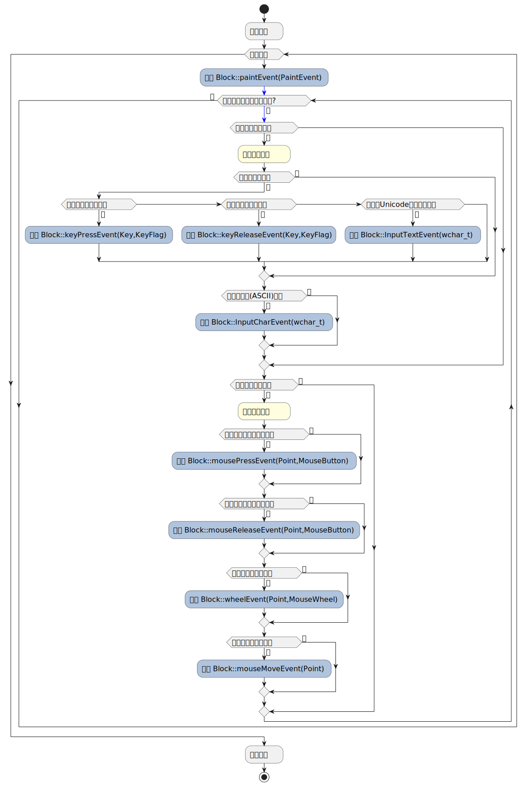

# 基本概念

## 信号-槽机制

### 什么是信号-槽机制？

信号-槽机制是一种广泛用于GUI编程的机制，它是一种对象间通信的机制，同时，它也是Egrome的核心机制之一。
在Egrome中，信号是一个对象，槽是连接到该信号的一系列可调用对象。当一个信号被发出时，它会自动调用所有与它连接的槽函数，并将信号参数传递给它们。信号和槽的连接是动态的，这意味着可以随时添加或删除信号与槽的连接。

> **C++：可调用对象（Callable object）**
> 
> 可调用对象可以是以下任意一种：
> - 函数/函数指针
> - 类指针与成员函数指针
> - 重载了函数调用运算符的类(仿函数)
> - lambda表达式

### Egrome中的信号槽机制

Egrome中的信号槽机制是通过一个类模板`Signal`来实现的。

> **C++：类模板（Template class）**
>
> C++是一种静态类型语言，为了使C++具有泛型编程能力，引入了模板机制。类模板在被使用时需要向其传入模板参数，使得编译器能够生成具体的类型。

Egrome中为模板类`Signal`定义了一个偏特化版本`Signal<void(Args...)>`和一个特化版本`Signal<void()>`，它们分别对应有参数的信号和无参数的信号。

> **C++：特化与偏特化（Partial specialization）**
>
> **特化**是指对模板进行具体化，指定当模板参数为一某具体类型时的具体实现。
>
> **偏特化**是指对模板进行部分具体化，指定当模板参数符合某一特定格式时的具体实现。

Egrome中`Signal`模板的偏特化版本`Signal<void(Args...)>`可以用来定义一个信号，其中`Args...`表示信号可以传递任意数量的参数。接下来，我们将介绍如何使用`Signal`模板来使用信号-槽机制。

在Egrome中，在使用信号槽机制之前，我们需要先引入关于信号槽机制的头文件`egrome/egrome/SignalSlots`，这样才能使用信号槽机制。

```c++
#include <egrome/SignalSlots>
```
我们可以定义一个信号对象，并向其模板参数中传入信号的槽函数类型，这样就创建了一个信号。

```c++
Signal<void(int, double)> signal;
Signal<void()> signal2;
```
我们可以向信号对象中连接槽函数，这样当信号被发出时，就会调用这些槽函数。

```c++
void slot1(int a, double b) {
    // do something
}

void slot2() {
    // do something
}

signal.connect(slot1);
signal2.connect(slot2);
```
我们可以调用信号对象的`emit`成员函数来发出信号，信号对象本身由于重载了函数调用运算符，因此它也可以作为其它信号的槽函数，实现信号的转发。

```c++
signal.emit(1, 2.0);
signal2.emit();
```
当信号`signal`被发出时，就会调用`slot1`函数，并将`1`和`2.0`作为参数传递给它。
当信号`signal2`被发出时，就会调用`slot2`函数。

我们可以调用`disconnect`成员函数来断开信号与槽的连接。由于原生C++并不能实现可调用对象之间的比较，因此`connect`方法在连接信号与槽时，会返回一个`id`，它是同一信号下的不同槽函数的唯一标识符。我们可以用这个`id`通过`disconnect`方法来断开信号与槽的连接。

```c++
auto id = signal.connect(slot1);
signal.disconnect(id);
```
断开信号与槽的连接后，发出信号时，不会再调用该槽函数。

### 完整示例

```c++
#include <iostream>
#include <egrome/SignalSlots>           // 引入信号槽机制的头文件

// 定义槽函数，槽函数可以是任意可调用对象

void slot1(int a, double b) {
    std::cout << "slot1: " << a << " " << b << std::endl;
}


void slot2() {
    std::cout << "slot2" << std::endl;
}

int main() {
    // 创建信号对象
    Signal<void(int, double)> signal;
    Signal<void()> signal2;
    // 连接槽函数
    auto id = signal.connect(slot1);
    signal2.connect(slot2);
    // 发出信号
    signal.emit(1, 2.0);
    signal2.emit();
    // 断开信号与槽的连接
    signal.disconnect(id);
    // 再次发出信号
    signal.emit(3, 4.0);    // 此时由于槽函数已经断开连接，不会调用slot1函数
    signal2.emit();

    return 0;
}
```
输出：
```
slot1: 1 2
slot2
slot2
```
## 事件循环机制

### 什么是事件循环机制？

事件循环机制是一种常见的GUI编程机制，它是一种程序的主循环，它不断地检查消息队列，并根据消息的类型调用相应的事件处理函数。同时，它也是信号槽机制的基础。

### Egrome中的事件循环

在Egrome中，事件循环是由`App::run()`所管理的，它是一个无限循环，不断地检查消息队列，并根据消息的类型调用相应的事件处理函数。Egrome中的事件循环流程如下图所示：

Egrome事件循环的周期是以帧为单位的，同时在一帧内，Egrome会尽可能多的调用除画面渲染以外的事件处理函数，以提高操作响应的效率。

## 帧渲染动画

### 什么是帧渲染动画？

帧渲染动画是一种用于GUI动画的技术，它可以让GUI元素实现一些动态交互效果，如移动、缩放、旋转、透明度变化、颜色变化等。

### Egrome中的帧渲染动画

Egrome中的帧渲染动画是通过模板类`Animation`来实现的，`Animation`模板类可以对指定类型的值进行插值计算，并将计算结果应用到指定对象上，来实现动态效果。Egrome中的`Animation`模板类默认提供了基础类型的线性插值计算，同时也支持自定义插值计算函数。

我们可以定义一个`Animation`对象，并指定变量的初始值、目标值以及插值计算函数和动画持续时间，这样就可以实现帧渲染动画。Egrome中的帧渲染动画依赖于事件循环中的渲染函数`paintEvent`，当我们需要对某一值添加动画时，只需要创建一个`Animation`对象，并将它与目标值绑定，然后在渲染函数中调用`Animation::value()`方法，就可以在渲染时获取到当前的动画值。

## Egrome的对象树

Egrome中的视图结构本质上是一个对象树，EGE窗口是整个对象树的根节点。这个对象树决定了Egrome的事件如何在对象间传递。在事件循环中，Egrome所调用的事件处理函数就是根节点的事件处理函数。Egrome通过基类`Block`来实现对象树的管理，`Block`也是所有UI对象的基类。`Block`提供了事件处理函数的接口，在它的默认行为中，它会将事件传递给它的子对象，并调用它们的事件处理函数，具有同一父对象的子对象的事件处理函数的调用顺序是由它们的zindex属性所决定的。